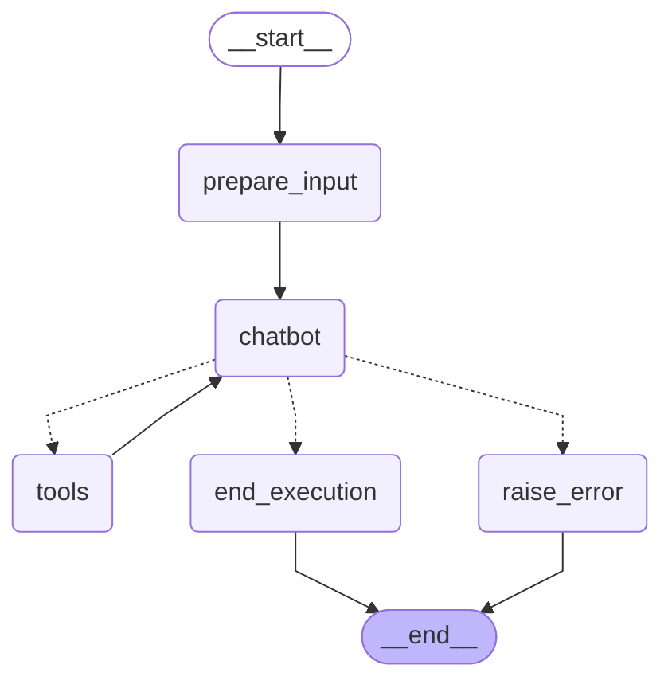

# UiPath LlamaIndex Gym Agents

This project demonstrates how to create a gym agent (e.g. calculator) using UiPath LlamaIndex graph with UiPath LLMGW. The agent has been converted from the original gym-sample structure to work as a runnable unattended agent while retaining the ability to accept interactive user input.


## Key Features

- **Unattended Operation**: Runs with predefined system and user prompts from `AgentBaseClass`
- **Interactive Mode**: Accepts user input via `uipath dev` or JSON input
- **Tool Integration**: Uses mathematical tools (add, multiply) with structured input validation
- **Error Handling**: Built-in error handling and execution termination tools

## Overview

The agent uses:
- LlamaIndex for orchestration
- Python tools

## Architecture



The workflow follows a ReAct pattern:
1. Query is sent to the agent (Claude)
2. Agent decides whether to use tools or provide a final answer
3. If tools are needed, the request is sent to the appropriate tool server
4. Results from tools are sent back to the agent
5. Process repeats until the agent has enough information to provide a final answer

## Prerequisites

- Python 3.10+
- `LlamaIndex`
- UiPath LLM auth parameters

## Installation

```bash
uv venv -p 3.11 .venv
.venv\Scripts\activate
uv sync
```

## Usage

### Interactive Mode
Run with custom user input by providing JSON with messages:

```bash
uv run uipath run agent '$AGENT_INPUT_SCHEMA'
```

### Development Mode
For interactive development and testing:

```bash
uv run uipath dev
```

## How It Works

The converted agent includes several key components:

1. **AgentBaseClass Configuration**: Defines system prompt, user prompt, and available tools
2. **Input Preparation Node**: Automatically sets up conversation context with system/user messages
3. **StateGraph Integration**: Seamlessly integrates with UiPath runtime expectations
4. **Dual Mode Operation**: Works both unattended and interactively

### Architecture Flow

```
START -> prepare_input -> chatbot -> conditional_routing -> tools/end_execution/raise_error
```

- `prepare_input`: Automatically detects unattended vs interactive mode and sets up appropriate messages
  - **Unattended**: Uses default system + user prompts from `AgentBaseClass` + datapoints for user prompt formatting
  - **Interactive**: Formats the user prompt with the interactive input and then runs using the system prompt and user prompt templates from `AgentBaseClass`
- `chatbot`: LLM interaction with tool calling capability
- `conditional_routing`: Determines next action based on LLM response
- `tools`: Executes mathematical operations (add, multiply)
- `end_execution`: Terminates with final result and confidence score

## Extending with New Tools

To add a new tool to the AgentBaseClass:

1. Create a `StructuredTool` using `StructuredTool.from_function()`
2. Add it to the `tools` list in the scenario configuration
3. The agent will automatically bind and use the new tool

## Agent Evaluation System

This project includes a comprehensive evaluation system that captures traces from UiPath LlamaIndex agents and evaluates their performance.

### How It Works

The system leverages UiPath's existing OpenTelemetry tracing infrastructure to capture actual `ReadableSpan` objects during agent execution, then runs evaluations on the captured traces.

### Usage

Run the complete evaluation pipeline:

```bash
cd samples/gym-sample
PYTHONPATH=src uv run python src/gym_sample/run.py
```

### Evaluation Types

#### ExactMatchEvaluator
- Compares actual agent output with expected output
- Returns boolean result (True/False)
- Uses canonical JSON comparison with number normalization

#### ToolCallOrderEvaluator
- Evaluates the sequence of tool calls
- Extracts tool names from `ReadableSpan.attributes.tool_name`
- Returns numerical score (0.0 to 1.0) using LCS algorithm

### Key Files

- `run.py` - Main evaluation script and agent execution
- `trace_utils.py` - OpenTelemetry trace collection utilities
- `evals.py` - Evaluator classes (ExactMatchEvaluator, ToolCallOrderEvaluator)
- `evals_utils.py` - Data structures (AgentExecution, EvaluationResult)

### Example Output

```
Agent executed successfully!
Input: {'expression': '15 + 7 * 3'}
Output: {'answer': 36.0}
Collected 16 trace spans

Running evaluations...

Evaluating Exact Match with criteria: {'answer': 36.0}
Result: score=1.0 evaluation_time=0.00004 score_type=NUMERICAL

Evaluating Tool Call Order with criteria: ['multiply', 'add']
Result: score=1.0 evaluation_time=0.00001 score_type=NUMERICAL
```

The tool call order score of 1.0 indicates perfect match - the agent called `multiply` then `add` as expected for the expression `15 + 7 * 3 = 15 + 21 = 36`.
